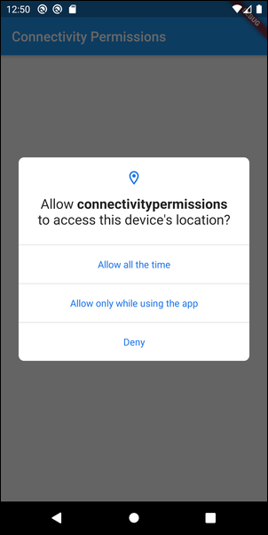
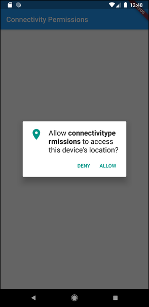
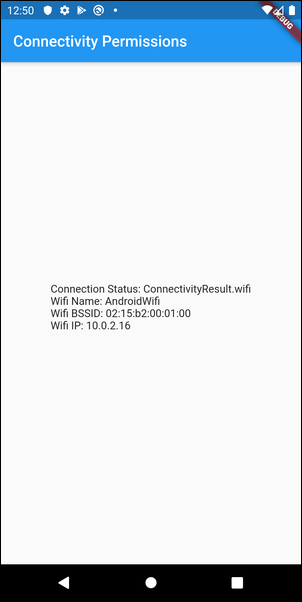

# Flutter Connectivity Package Android Permissions

While building a Flutter application that needed to access information about the system's Wi-Fi network, I encountered the [connectivity](https://pub.dev/packages/connectivity) package. It looked like what I needed, and I quickly added it to my app. In testing with my application, I had connectivity working correctly, but then suddenly it stopped working. I noticed this when I switched from testing on an Android device Emulator; the app would 'run' but returned `null` for Wi-Fi network name and BSSID.

I had no idea what I did to the app, but I knew it was working and that suddenly it wasn't. I looked carefully at the app source and compared it to the example code on the package's landing page, but made no progress. I noticed that when testing it on a device, that a permissions dialog popped up asking me to approve permission for location settings (the ability to tell where an Android device is tied to Wi-Fi settings for security purposes - who knew?), but the dialog would close before I could do anything, then the app crashed. That led me to think I had a permissions issue.

I knew there were permission settings I needed, but the package landing page and documentation made no reference to them. I headed over to Stack Overflow and created an [issue](https://stackoverflow.com/questions/62378654/flutter-connectivity-package-android-permissions). While I waited for a response there, I poked around on the Internet until I found an [issue in the Flutter repo](https://github.com/flutter/flutter/issues/51529) that seemed to describe my issue. Looking deeper, it was a permissions issue and the solution was there in the comments.

Flutter doesn't seem to have a way to query an app user for permissions, so someone created the Flutter [permissions_handler](https://pub.dev/packages/permission_handler) package. Adding that to my app, and a variant of the code shown in the original issue, solved my issue.

I quickly realized that the answer on the Flutter repo was incomplete and anyone trying to implement this solution would need some help. To make it easier for these developers, I created a complete sample application here in this repo.

Here's what I did

Starting with the project's `pubspec.yaml` file, I added the connectivity and permissions_handler packages:

```yml
dependencies:
  flutter:
    sdk: flutter

  cupertino_icons: ^0.1.3
  connectivity: ^0.4.8+6  
  permission_handler: ^5.0.1
```

Next, I added the imports to the project's `main.dart` file:

```dart
import 'package:connectivity/connectivity.dart';
import 'package:permission_handler/permission_handler.dart';
```

Then I added some code to the `initConnectivity` function:

```dart
Future<void> initConnectivity() async {
  ConnectivityResult result;
  // Platform messages may fail, so we use a try/catch PlatformException.
  try {
    result = await _connectivity.checkConnectivity();
  } on PlatformException catch (e) {
    print(e.toString());
  }

  // If the widget was removed from the tree while the asynchronous platform
  // message was in flight, we want to discard the reply rather than calling
  // setState to update our non-existent appearance.
  if (!mounted) {
    return Future.value(null);
  }

  // Check to see if Android Location permissions are enabled
  // Described in https://github.com/flutter/flutter/issues/51529
  if (Platform.isAndroid) {
    print('Checking Android permissions');
    var status = await Permission.location.status;
    // Blocked?
    if (status.isUndetermined || status.isDenied || status.isRestricted) {
      // Ask the user to unblock
      if (await Permission.location.request().isGranted) {
        // Either the permission was already granted before or the user just granted it.
        print('Location permission granted');
      } else {
        print('Location permission not granted');
      }
    } else {
      print('Permission already granted (previous execution?)');
    }
  }

  return _updateConnectionStatus(result);
}
```

The code I added is:

```dart
// Check to see if Android Location permissions are enabled
// Described in https://github.com/flutter/flutter/issues/51529
if (Platform.isAndroid) {
  print('Checking Android permissions');
  var status = await Permission.location.status;
  // Blocked?
  if (status.isUndetermined || status.isDenied || status.isRestricted) {
    // Ask the user to unblock
    if (await Permission.location.request().isGranted) {
      // Either the permission was already granted before or the user just granted it.
      print('Location permission granted');
    } else {
      print('Location permission not granted');
    }
  } else {
    print('Permission already granted (previous execution?)');
  }
}
```

This code executes once at startup and checks permissions before retrieving connection status from the device.

If you run the code at this point, everything will seem to work, but the values for Wi-Fi Name, BSSID and IP address will all report `null`. When you look at the console, you'll see:

```text
I/flutter ( 6506): Checking Android permissions
I/flutter ( 6506): Result: ConnectivityResult.wifi
D/permissions_handler( 6506): No permissions found in manifest for: 3
I/flutter ( 6506): Wi-Fi Name: null
D/permissions_handler( 6506): No permissions found in manifest for: 3
I/flutter ( 6506): Location permission not granted
I/flutter ( 6506): Result: ConnectivityResult.wifi
I/flutter ( 6506): BSSID: 02:00:00:00:00:00
I/flutter ( 6506): Wi-Fi Name: null
I/flutter ( 6506): BSSID: 02:00:00:00:00:00
```

That's because without the right permissions defined within the app, the `status` value is `null` and none of the other permissions checking stuff happens. The user is never even asked for permission as expected.

To solve this, open the project's `android/app/src/main/AndroidManifest.xml` file and add the location permission to the app's config:

```xml
<uses-permission android:name="android.permission.ACCESS_COARSE_LOCATION" />
```

I used the course setting, you can use the fine too I think.

So many times writers tell you what permission change to make, but don't tell you where it should be made in the file. I don't do a lot of native Android development, so I'm never sure where to put that setting, so here's the complete file listing so you can see its proper place:

```xml
<manifest xmlns:android="http://schemas.android.com/apk/res/android"
    package="com.johnwargo.connectivitypermissions">
    <uses-permission android:name="android.permission.ACCESS_COARSE_LOCATION" />
    <application
        android:name="io.flutter.app.FlutterApplication"
        android:label="connectivitypermissions"
        android:icon="@mipmap/ic_launcher">
        <activity
            android:name=".MainActivity"
            android:launchMode="singleTop"
            android:theme="@style/LaunchTheme"
            android:configChanges="orientation|keyboardHidden|keyboard|screenSize|smallestScreenSize|locale|layoutDirection|fontScale|screenLayout|density|uiMode"
            android:hardwareAccelerated="true"
            android:windowSoftInputMode="adjustResize">
            <!-- Specifies an Android theme to apply to this Activity as soon as
                 the Android process has started. This theme is visible to the user
                 while the Flutter UI initializes. After that, this theme continues
                 to determine the Window background behind the Flutter UI. -->
            <meta-data
              android:name="io.flutter.embedding.android.NormalTheme"
              android:resource="@style/NormalTheme"
              />
            <!-- Displays an Android View that continues showing the launch screen
                 Drawable until Flutter paints its first frame, then this splash
                 screen fades out. A splash screen is useful to avoid any visual
                 gap between the end of Android's launch screen and the painting of
                 Flutter's first frame. -->
            <meta-data
              android:name="io.flutter.embedding.android.SplashScreenDrawable"
              android:resource="@drawable/launch_background"
              />
            <intent-filter>
                <action android:name="android.intent.action.MAIN"/>
                <category android:name="android.intent.category.LAUNCHER"/>
            </intent-filter>
        </activity>
        <!-- Don't delete the meta-data below.
             This is used by the Flutter tool to generate GeneratedPluginRegistrant.java -->
        <meta-data
            android:name="flutterEmbedding"
            android:value="2" />
    </application>
</manifest>
```
When you launch the app on Android API 29, it looks like this:



For my particular app I don't care about getting settings from the device when the app isn't running, so I selected 'Allow only when using the app`. If you look in the console, you'll see the following:

```text
I/flutter ( 7670): Checking Android permissions
I/flutter ( 7670): Result: ConnectivityResult.wifi
I/flutter ( 7670): Wi-Fi Name: null
I/flutter ( 7670): BSSID: 02:00:00:00:00:00
I/flutter ( 7670): Location permission granted
I/flutter ( 7670): Result: ConnectivityResult.wifi
I/flutter ( 7670): Wi-Fi Name: AndroidWifi
I/flutter ( 7670): BSSID: 02:15:b2:00:01:00
```

Notice the app goes ahead and checks Wi-Fi settings while it waits for the user to grant permission; that's because of the way the code is written, you could easily tweak this so it waits for permission before trying, but it runs the init twice, so you'll get the right data the second time around (no, I don't know why it runs twice).

On older OS versions, the permissions prompt looks like this:



And here's the Wi-Fi settings results:



***

If you find this code useful, and feel like thanking me for providing it, please consider making a purchase from [my Amazon Wish List](https://amzn.com/w/1WI6AAUKPT5P9). You can find information on many different topics on my [personal blog](http://www.johnwargo.com). Learn about all of my publications at [John Wargo Books](http://www.johnwargobooks.com).
